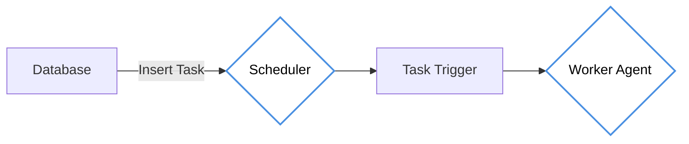

# Scheduler

## Introduction

The `Scheduler` component allows users to create, assign, and prioritize tasks easily. Users can set task triggers, allocate resources, and define dependencies between tasks. Real-time updates and event notifications keep stakeholders informed about task progress. It is a crucial software component that automates the execution of tasks at specific intervals or conditions, optimizing resource management and ensuring timely performance across various computing environments.

---

## Diagram



---

## Run the Scheduler

For running the Scheduler we can use the below command 

```bash

bash bin.sh
```

---

## Frequently Asked Questions

**Q: What does the Scheduler component do?**
A: The Scheduler automates the execution of tasks at specific intervals or conditions. It allows users to create, assign, and prioritize tasks with triggers, resource allocation, and dependencies, while providing real-time updates and event notifications.

**Q: How do I run the Scheduler?**
A: You can start the Scheduler using the command `bash bin.sh` or manage it as a container with `podman start easytask-scheduler`. Refer to the Scheduler Management guide for detailed start/stop procedures.

**Q: What is the relationship between the Scheduler and Worker Agents?**
A: The Scheduler reads task definitions from the database, determines when tasks should run based on triggers and dependencies, and then dispatches them to Worker Agents for actual execution. Worker Agents run on target hosts and report results back.

## Next Steps

- [Scheduler Management](./scheduler_management.md)
- [Scheduler Instance](./scheduler_instance.md)
- [Scheduler Events](./scheduler_events.md)
