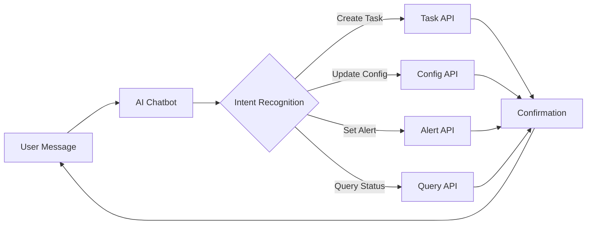

# 🤖 EasyTask AI Support Chatbot

## Introduction

The **EasyTask AI Support Chatbot** is an intelligent conversational assistant built directly into the EasyTask platform. It enables administrators and operators to manage tasks, configure alerting rules, update schedules, and perform common platform operations — all through natural language conversation.

Instead of navigating through menus and forms, simply tell the chatbot what you need and it translates your request into the appropriate platform action.

---

## Key Capabilities

### :material-plus-circle: Task & Task Group Management

- **Create tasks** — "Create a new task called `daily_report` that runs the shell script `/opt/scripts/report.sh` every day at 6 AM."
- **Update tasks** — "Change the schedule of the `daily_report` task to run at 8 AM instead."
- **Delete tasks** — "Remove the old `test_cleanup` task."
- **Create task groups** — "Group the finance tasks into a task group called `finance_batch`."

### :material-bell-ring: Alert Configuration

- **Set up alerts** — "Send me an email alert whenever the `invoice_processing` task fails."
- **Modify alert rules** — "Change the failure alert for `invoice_processing` to also notify the ops channel on Slack."
- **Review alerts** — "Show me all active alert rules for the finance namespace."

### :material-cog: Configuration Updates

- **Adjust schedules** — "Move all tasks in the `batch` group to run during off-peak hours between 10 PM and 2 AM."
- **Manage dependencies** — "Make the `generate_report` task depend on `data_import` completing successfully first."
- **Toggle tasks** — "Disable the `legacy_export` task until further notice."

### :material-chart-box: Monitoring & Diagnostics

- **Check status** — "What's the status of the `payment_batch` task group?"
- **View recent runs** — "Show me the last 5 runs of the `sync_inventory` task."
- **Investigate failures** — "Why did the `order_processing` task fail last night?"

---

## How It Works

1. **You ask** — Type your request in natural language in the chatbot interface.
2. **The chatbot interprets** — It identifies the intent (create, update, query, alert) and extracts the relevant parameters.
3. **Action is executed** — The appropriate EasyTask API is called with validated parameters.
4. **Confirmation returned** — The chatbot confirms what was done or shows the requested information.

---

## Security & Permissions

The chatbot inherits the logged-in user's role-based permissions:

- Users can only perform actions they are authorized for.
- All chatbot-initiated operations are recorded in the audit log with a `chatbot` source tag.
- Sensitive operations (delete, bulk disable) require explicit confirmation before execution.

---

## Examples

| You Say | Chatbot Action |
|---------|---------------|
| "Create a task to back up the database at midnight" | Creates a scheduled task with a daily midnight cron trigger |
| "Alert me on Slack if the ETL pipeline fails" | Configures a failure alert routed to the Slack integration |
| "Show failed tasks from yesterday" | Queries task run history and displays failures with log excerpts |
| "Pause all tasks in the staging namespace" | Disables all tasks in the `staging` scheduler instance |
| "When does the monthly report run?" | Returns the schedule details for the matching task |

---

## Frequently Asked Questions

### How do I access the EasyTask chatbot?
The chatbot is available in the EasyTask web console. Click the chat icon in the bottom-right corner of any page to open the conversation panel.

### Can the chatbot modify running tasks?
Yes. The chatbot can update task schedules, toggle enable/disable state, modify dependencies, and change alert rules for any task you have permission to manage.

### Are chatbot actions logged?
Absolutely. Every action the chatbot performs is recorded in the audit trail with full details — the original user message, the interpreted intent, the API call made, and the result.

### Does the chatbot work with all EasyTask integrations?
The chatbot can configure alerting for all supported integration channels including email, Slack, Microsoft Teams, and webhook endpoints.
