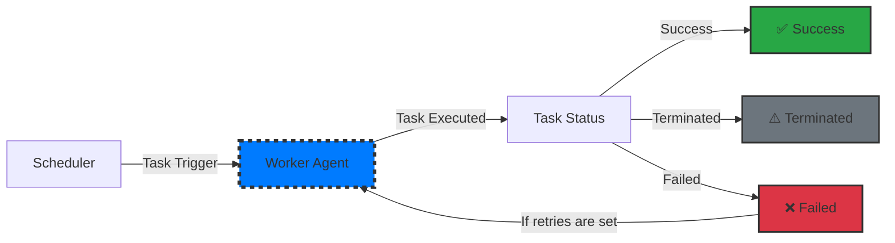

# :material-rocket-launch: EasyTask Worker Agent Introduction

## :material-lightbulb: What is a Worker Agent?

The **EasyTask Worker Agent** is a lightweight process deployed on target hosts that executes tasks assigned by the Scheduler. It is the execution engine of the EasyTask platform — receiving commands, running them locally, capturing output, and reporting results back to the scheduler in real time.

Worker Agents enable distributed task execution across multiple machines, making the system scalable, efficient, and reliable even under heavy workloads. Each agent:

- Receives tasks from the Scheduler and executes them
- Reports task outcomes back to the Scheduler
- Streams real-time execution logs to the web console
- Enables efficient use of CPU, memory, and network resources across multiple agents

---

## :material-star: Key Features

- :material-cog: **Task Execution**
  Executes assigned tasks in a timely, efficient manner.

- :material-web: **Decentralized Processing**
  Distributes workloads across multiple agents, enhancing scalability and performance.

- :material-swap-vertical: **Communication with Scheduler**
  Continuously updates the Scheduler on task progress and results.

- :material-shield: **Fault Handling & Recovery**
  Manages retries and recovery for failed tasks, ensuring reliability.

- :material-chart-line: **Concurrency & Parallelism**
  Supports multithreaded, multiprocess, and distributed execution models.

- :material-package-variant: **Queue-Based Processing**
  Uses a message broker to balance workloads and ensure fault tolerance.

- :material-magnify: **Logging & Monitoring**
  Captures detailed logs, task statuses, and error details for debugging and tracking.

- :material-database: **Task Result Storage**
  Stores outputs in backend systems to support chaining and dependency management.

- :material-chart-bar: **Scalability & Load Balancing**
  Dynamically scales workers based on system load, optimizing high-throughput task handling.

---

## :material-clipboard-check: Worker Agent Responsibilities

:material-check: **Task Execution** → Retrieves tasks and executes them efficiently.
:material-check: **Concurrency & Parallelism** → Maximizes resource usage.
:material-check: **Queue-Based Processing** → Ensures scalable, fault-tolerant execution.
:material-check: **Error Handling & Retries** → Applies automatic retry strategies.
:material-check: **Logging & Monitoring** → Provides rich operational insights.
:material-check: **Task Result Storage** → Saves outputs for downstream tasks.
:material-check: **Scalability & Load Balancing** → Adapts to system demands.

---

## :material-sitemap: Workflow Overview

The Worker Agent receives tasks from the Scheduler, executes them, evaluates outcomes, and reports results.

### Workflow Explained

1. **Scheduler** → Triggers tasks and hands them to the Worker Agent.
2. **Worker Agent** → Executes tasks and monitors progress.
3. **Task Execution** → Runs the task using system resources.
4. **Task Status Evaluation** → Determines the outcome:
   - :material-check: **Success** → Task completed successfully.
   - :material-close: **Failed** → Task failed; may trigger retries.
   - :material-alert: **Terminated** → Task was stopped or killed before completion.

---

## :material-text-box-search: Real-Time Log Streaming & Historical Logs

The EasyTask Worker Agent supports **real-time log streaming** of task execution output directly to the web console and API consumers.

### Live Log Streaming

- Task execution output (stdout and stderr) is streamed in real time as tasks run.
- Logs are accessible from the web console under the task run detail view.
- Supports log-level filtering (INFO, WARN, ERROR, DEBUG) and full-text search.
- Multiple users can observe the same task's live output simultaneously.

### Historical Execution Logs

- Every task execution produces a persistent log entry stored in the data store.
- Browse historical logs by date range, task name, status, or agent host.
- Drill into individual task runs to view the complete output, exit code, and execution timeline.
- Export logs for compliance auditing or offline analysis.

> :material-lightbulb: **Tip:** Use the log viewer in the Web UI to correlate task failures with scheduler events and system metrics for faster root cause analysis.

---

## :material-console: Adhoc Command Execution

In addition to scheduled task execution, the Worker Agent supports **adhoc command execution** — running one-off commands on demand without defining a task.

### How Adhoc Commands Work

1. Submit a command through the web console or CLI.
2. The command is dispatched to selected agents (single agent, a group, or all agents).
3. The agent executes the command and returns the output in real time.
4. Results are aggregated and displayed in the console with per-agent status.

### Common Use Cases

- **Diagnostics**: Run health checks, disk usage, or process inspections across all agents.
- **Patches**: Apply emergency configuration changes or script updates fleet-wide.
- **File Operations**: Copy or verify files across agents without scheduling a task.
- **Quick Scripts**: Execute bash, Python, or other scripts adhoc for on-the-fly operations.

> :material-alert: **Note:** Adhoc commands respect the agent's permission model. Only authorized users can execute commands, and all adhoc executions are recorded in the audit log.

---

## :material-help-circle: Frequently Asked Questions

### How do I deploy a Worker Agent?
Worker agents are deployed as Podman containers on each target host. The installation process involves downloading the EasyTask agent image, configuring the connection to your scheduler, and starting the agent container. Detailed steps are in the [Agent Installation Guide](../installation/install_agent.md).

### Can a single host run multiple Worker Agents?
Yes. You can run multiple agent instances on a single host to increase parallel execution capacity. Each agent operates independently and can handle its own queue of tasks. This is useful for hosts with high CPU and memory resources.

### What happens when an agent goes offline?
Agents send periodic heartbeats to the scheduler. If an agent misses heartbeats, the scheduler marks it as unreachable and will not dispatch new tasks to it. Tasks already queued for that agent will remain in a pending state until the agent comes back online or the task timeout is exceeded.

---

## :material-arrow-right: Next Steps

- [Agent Management](worker_agent_management.md) — manage and configure worker agents
- [Scheduler Component](scheduler.md) — understand the scheduler's role in task orchestration
- [Task Lifecycle](task_lifecycle.md) — trace a task from creation to completion
- [Integration Server](integration_server.md) — connect EasyTask to external systems
