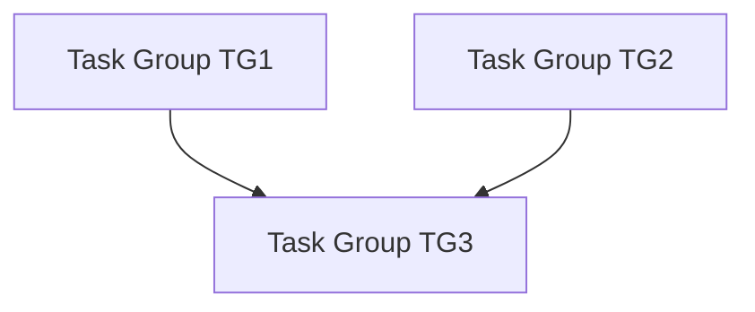


---
title: Task Groups - EasyTask Documentation
description: Learn how to create and manage task groups in EasyTask with shared scheduling, dependencies between groups, and coordinated task execution.
keywords:
  - easytask task groups
  - easytask
  - task dependencies
  - group scheduling
  - task orchestration
  - workflow automation
---

# 📦 Introduction to Task Group

## 📄 What is a Task Group?

A **Task Group** is a logical collection of tasks organized under shared configurations. It allows you to group multiple tasks, define execution dependencies, and control their execution order. You can also set **dependencies between groups**, where one group becomes eligible to run based on the completion or status of another.

Tasks that are **not part of any group** are treated as **single tasks** and operate independently.

!!! warning "Important"
    ⚠️ Tasks within a group can **only depend on tasks inside the same group** — they cannot reference tasks from another group.

---

## 💾 Sample Task Group JSON

```json
{
  "gid": 3000003,
  "name": "TG3",
  "day_of_week": "1111111",
  "trigger_times": "11:15",
  "description": "Run an ls command",
  "timezone": "US/Eastern",
  "dependency": "(S:TG1) and (S:TG2)",
  "active": true,
  "instance": "default"
}
```

## 🗂️ Task Group Definition

| `Field`           | `Type`   | `Mandatory` | `Description`                          | `Examples`                |
|-------------------|-----------|-------------|----------------------------------------|---------------------------|
| `name`          | String    | Yes         | Group name                             | "TG1"                    |
| `description`    | String    | Yes         | Group description                      | "Daily tasks group"      |
| `day_of_week`    | String    | Yes         | 7-digit binary for weekdays (Mon-Sun)  | "1111100"                |
| `run_day_of_week`| Boolean   | Yes         | Run on working days                    | true                     |
| `trigger_times`  | String    | Yes         | Execution times                         | "14:52, 05:51"           |
| `timezone`       | String    | Yes         | Local timezone                          | "US/Eastern"             |
| `active`        | Boolean   | Yes         | Group active status                     | true                    |
| `dependency`    | String    | No          | Dependency on other groups             | "(S:TG1) and (S:TG2)"    |
| 🚫 **`run_on_host`**   | —  | Cannot Have | ❌ Invalid in task groups               | —                        |
| 🚫 **`run_as_user`**   | —  | Cannot Have | ❌ Invalid in task groups               | —                        |
| 🚫 **`profile`**       | —  | Cannot Have | ❌ Invalid in task groups               | —                        |
| 🚫 **`max_run_time`** | —  | Cannot Have | ❌ Invalid in task groups               | —                        |

---

## 📅 Understanding day_of_week Format

The `day_of_week` field uses a **7-digit binary string** to specify which days of the week a task group should run.

### Format Structure

```
Position:  1    2    3    4    5    6    7
Day:       Mon  Tue  Wed  Thu  Fri  Sat  Sun
Binary:    1    1    1    1    1    0    0
```

- **`1`** = Run on this day
- **`0`** = Do not run on this day
- **Position 1** = Monday (first day)
- **Position 7** = Sunday (last day)

### Common Examples

| Binary String | Days Selected | Description |
|--------------|---------------|-------------|
| `"1111111"` | Mon-Tue-Wed-Thu-Fri-Sat-Sun | Every day |
| `"1111100"` | Mon-Tue-Wed-Thu-Fri | Weekdays only (Monday-Friday) |
| `"0000011"` | Sat-Sun | Weekends only |
| `"1000000"` | Mon | Mondays only |
| `"0100000"` | Tue | Tuesdays only |
| `"0010000"` | Wed | Wednesdays only |
| `"0001000"` | Thu | Thursdays only |
| `"0000100"` | Fri | Fridays only |
| `"0000010"` | Sat | Saturdays only |
| `"0000001"` | Sun | Sundays only |
| `"1111000"` | Mon-Tue-Wed-Thu | First 4 days of week |
| `"0111110"` | Tue-Wed-Thu-Fri | Mid-week (Tuesday-Thursday) |
| `"1010101"` | Mon-Wed-Fri-Sun | Alternate days |

### Important Notes

!!! note "Day Order"
    The binary string **always starts with Monday** as position 1 and ends with Sunday as position 7. This order is fixed and cannot be changed.

!!! warning "Common Mistakes"
    - ❌ Don't use `"0111110"` thinking it means Monday-Friday (it actually means Tuesday-Saturday)
    - ❌ Don't reverse the order (Sunday-Saturday)
    - ✅ Always use Monday-Sunday order: `"1111100"` for weekdays

### Practical Examples

#### Business Hours Task Group (Weekdays Only)
```json
{
  "name": "business_hours_group",
  "day_of_week": "1111100",  // Monday-Friday only
  "trigger_times": "09:00, 13:00, 17:00",
  "timezone": "US/Eastern"
}
```

#### Weekend Maintenance Group
```json
{
  "name": "weekend_maintenance",
  "day_of_week": "0000011",  // Saturday-Sunday only
  "trigger_times": "02:00",
  "timezone": "US/Eastern"
}
```

#### Mid-Week Processing Group
```json
{
  "name": "mid_week_reports",
  "day_of_week": "0011110",  // Tuesday, Wednesday, Thursday
  "trigger_times": "10:00",
  "timezone": "US/Eastern"
}
```

---

## 🛠️ Task Part of a Group

| `Field`          | `Type`    | `Mandatory` | `Description`                         | `Examples`               |
|------------------|-----------|-------------|--------------------------------------|--------------------------|
| `id`           | Integer    | Yes         | Unique task ID                       | 200001                  |
| `name`         | String     | Yes         | Task name                            | "run_ls_task"           |
| `task_owner`   | String     | Yes         | Owner of the task                    | "admin"                 |
| `cmd`         | String      | Yes         | Command to run                       | "ls -a"                 |
| `run_on_host` | String      | Yes         | Host where the task runs             | "12.18.28.91"           |
| `run_as_user` | String      | Yes         | User executing the task              | "evolveadmin"           |
| `description` | String      | Yes         | Task description                     | "Run an ls command"     |
| `active`      | Boolean     | Yes         | Task active status                   | true                   |
| `stdout`      | String      | Yes         | Path for standard output             | "/tmp/ls.out"           |
| `stderr`      | String      | Yes         | Path for standard error              | "/tmp/ls.err"           |
| `retry_attempts`| Integer   | No          | Number of retry attempts on failure  | —                      |
| `profile`     | String      | No          | Path to task profile                 | "~/.profile"           |
| `calendar`    | Integer     | No          | Calendar information                 | —                      |
| `max_run_time`| Integer     | No          | Maximum runtime (max 82800 sec)      | 3600                   |
| 🚫 **`day_of_week`**    | —  | Cannot Have | ❌ Invalid in tasks                  | —                      |
| 🚫 **`run_day_of_week`**| —  | Cannot Have | ❌ Invalid in tasks                  | —                      |
| 🚫 **`trigger_times`**  | —  | Cannot Have | ❌ Invalid in tasks                  | —                      |

---

## 📌 Dependency Format

```json
{
  "dependency": "(S:TG1) and (S:TG2)"
}
```

This means the group only runs if **TG1 and TG2** complete with a **SUCCESS** state.

---

## 📊 Dependency Diagram



---

## ✅ Expression Syntax

- **Format:** `(STATE:TASK_GROUP_NAME)`
- **Operators:** `and`, `or`, `()`

---

## 🔁 Task States

| Code | State       | Description                 |
|------|------------|-----------------------------|
| I    | IDLE      | Inactive task               |
| P    | PASSIVE   | Waiting to activate         |
| A    | ACTIVE    | Ready but not running       |
| Z    | TRIGGER   | Marked for triggering       |
| D    | STARTED   | Beginning execution         |
| R    | RUNNING   | In progress                |
| E    | REJECTED  | Rejected, won’t run        |
| F    | FAILED    | Execution failed           |
| S    | SUCCESS   | Completed successfully     |
| G    | RESTARTING| Restarting process         |
| T    | TERMINATED| Manually stopped           |
| O    | FREEZE    | Paused                    |
| U    | UNFREEZE  | Resumed from freeze       |

---

## 🔒 Integrity Requirements

- All referenced task names **must exist**.
- Invalid task names or states will block dependency resolution.

---

## Frequently Asked Questions

**Can tasks in one group depend on tasks in another group?**
No. Tasks within a group can only depend on other tasks in the same group. However, groups themselves can depend on other groups using the `dependency` field.

**Why can't I use run_frequency for task groups?**
Task groups only support `trigger_times` for scheduling. This ensures deterministic execution order when managing dependencies between tasks within the group.

**Do tasks in a group inherit scheduling from the parent group?**
Yes. Tasks in a group cannot define their own `day_of_week`, `trigger_times`, `timezone`, or `ordinal_day` — these are all inherited from the parent task group definition.

---

## Next Steps

- [Task Definition](./task.md) — Complete field reference for individual tasks
- [Task Lifecycle](./task_lifecycle.md) — Understand task states and transitions
- [Troubleshooting Guide](../installation/trouble_shoot.md) — Resolve common issues
