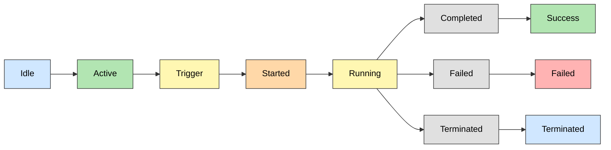

# Task Lifecycle

## 🧱 What is a Task?

In **EasyTask**, a **task** represents a unit of work that the system schedules and executes. Tasks can range from running shell commands or executing scripts to invoking APIs or triggering workflows in external systems. Each task includes metadata such as:

- Command or operation to perform
- Execution environment or host
- Time constraints and retries
- Dependencies and triggering conditions
- Output handling and logging rules

Tasks form the building blocks of your automation pipeline, enabling structured, repeatable, and observable execution across distributed systems.

---

## 📘 Lifecycle of a Task

The **Task Lifecycle** defines the journey of a task from creation to completion in the EasyTask scheduler. Understanding this lifecycle helps teams track execution phases, detect issues early, and improve resource utilization.

Each stage reflects a critical state of the task's progress — from being idle to executing, succeeding, failing, or being terminated.

---
## 🔄 Task Workflow

---

## 🧩 Task Lifecycle States

- :material-pause-circle-outline: **Idle**  
  The default resting state where no task is active or scheduled.

- :material-play-circle-outline: **Active**  
  The system is engaged and ready to process tasks.

- :material-flash: **Trigger**  
  An event or condition (manual or automated) that initiates a task.

- :material-rocket-launch: **Started**  
  Task preparation has begun — environment setup or dependencies being resolved.

- :material-run: **Running**  
  The task is in execution — logic, scripts, or workflows are in progress.

- :material-check-circle: **Success**  
  The task completed its operation and met all defined conditions successfully.

- :material-alert-circle: **Failed**  
  The task encountered errors, exceptions, or timeouts that caused failure.

- :material-cancel: **Terminated**  
  The task was forcibly stopped — by user intervention or policy rules.

---

> 🔎 Monitoring task transitions through these stages helps debug issues and optimize automation pipelines.

---

## Frequently Asked Questions

**What happens when a task fails?**
A failed task transitions to the Failed state. If retry_attempts are configured, the task may automatically restart (RESTARTING state) before succeeding or permanently failing.

**Can a running task be stopped manually?**
Yes. A running task can be terminated by user intervention or policy rules, transitioning it to the Terminated state.

**What is the difference between Idle and Passive states?**
Idle is the default resting state where no task is active or scheduled. Passive means the task is registered but dormant and waiting — typically used for tasks that depend on external triggers.

---

## Next Steps

- [Task Definition](./task.md) — Learn how to create and configure tasks
- [Task Groups](./task_group.md) — Organize tasks into groups with dependencies
- [Verify Your Installation](../installation/verify_install.md) — Confirm agents are running before scheduling tasks
