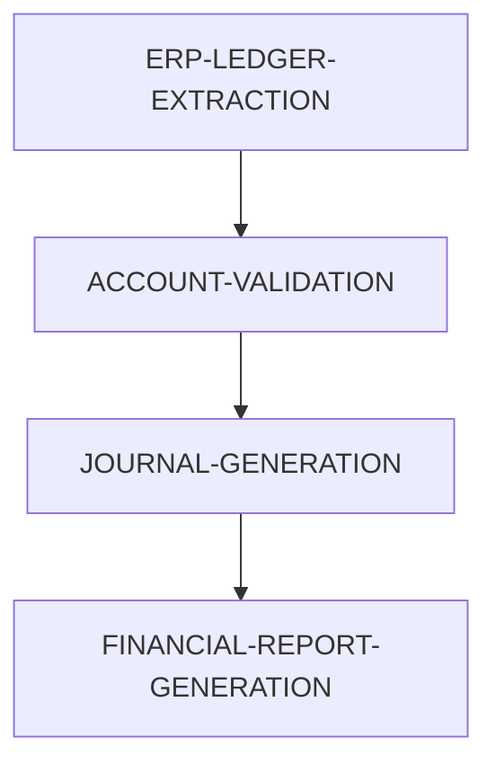


---
title: Month-End Accounting Workflow - EasyTask Documentation
description: Automate monthly accounting workflows with EasyTask including ERP data extraction, validation, journal entry generation, and financial report consolidation.
keywords:
  - accounting workflow
  - easytask
  - month-end close
  - financial automation
  - erp integration
---

## 🧾 Use Case: Month-End Accounting Workflow

This use case automates monthly accounting workflows including data ingestion from ERP systems, validation, journal entry generation, and financial report consolidation.

**Objective:**

1. 📥 Extract monthly ledger data from ERP systems
2. 🧮 Validate balances and reconcile accounts
3. 📜 Generate journal entries in accounting DB
4. 📊 Create consolidated P\&L and balance sheet reports

---

## 🔗 Accounting Workflow Dependency Graph



---

## 🧩 Task Group Definitions for Accounting Use Case

### 📂 ERP-LEDGER-EXTRACTION

```json
{
  "gid": 7000001,
  "name": "ERP-LEDGER-EXTRACTION",
  "description": "Extract general ledger and subledger balances",
  "trigger_times": "23:00",
  "day_of_week": "0000001",
  "timezone": "US/Eastern",
  "active": true,
  "instance": "default"
}
```

### 🧾 ACCOUNT-VALIDATION

```json
{
  "gid": 7000002,
  "name": "ACCOUNT-VALIDATION",
  "description": "Validate account balances and cross-ledger integrity",
  "trigger_times": "23:15",
  "dependency": "(S:ERP-LEDGER-EXTRACTION)",
  "timezone": "US/Eastern",
  "active": true,
  "instance": "default"
}
```

### 📓 JOURNAL-GENERATION

```json
{
  "gid": 7000003,
  "name": "JOURNAL-GENERATION",
  "description": "Generate journal entries from ledger deltas",
  "trigger_times": "23:30",
  "dependency": "(S:ACCOUNT-VALIDATION)",
  "timezone": "US/Eastern",
  "active": true,
  "instance": "default"
}
```

### 📊 FINANCIAL-REPORT-GENERATION

```json
{
  "gid": 7000004,
  "name": "FINANCIAL-REPORT-GENERATION",
  "description": "Compile monthly financial reports",
  "trigger_times": "23:45",
  "dependency": "(S:JOURNAL-GENERATION)",
  "timezone": "US/Eastern",
  "active": true,
  "instance": "default"
}
```

---

## 🔧 Task Definitions for Accounting Use Case

### 🧾 EXTRACT\_ERP\_LEDGER

```json
{
  "tid": 4000001,
  "name": "EXTRACT_ERP_LEDGER",
  "task_group": "ERP-LEDGER-EXTRACTION",
  "cmd": "python ./extract_ledger.py -d ${YYYYMMDD}",
  "run_on_host": "acct-node1",
  "run_as_user": "erpadmin",
  "description": "Pull ledger balances from ERP",
  "retry_attempts": 3,
  "max_run_time": 180,
  "stdout": "/logs/ledger_extract.out",
  "stderr": "/logs/ledger_extract.err",
  "profile": "~/.profile",
  "calendar": "US_HOLIDAYS",
  "active": true,
  "instance": "default"
}
```

### 🔍 VALIDATE\_BALANCES

```json
{
  "tid": 4000002,
  "name": "VALIDATE_BALANCES",
  "task_group": "ACCOUNT-VALIDATION",
  "cmd": "python ./validate_balances.py -d ${YYYYMMDD}",
  "run_on_host": "acct-node2",
  "run_as_user": "acctops",
  "description": "Cross-check balance integrity",
  "retry_attempts": 2,
  "max_run_time": 120,
  "stdout": "/logs/validate_bal.out",
  "stderr": "/logs/validate_bal.err",
  "profile": "~/.profile",
  "calendar": "US_HOLIDAYS",
  "active": true,
  "instance": "default"
}
```

### 📝 GENERATE\_JOURNALS

```json
{
  "tid": 4000003,
  "name": "GENERATE_JOURNALS",
  "task_group": "JOURNAL-GENERATION",
  "cmd": "python ./generate_journals.py -d ${YYYYMMDD}",
  "run_on_host": "acct-node2",
  "run_as_user": "glentry",
  "description": "Write journal entries to GL",
  "retry_attempts": 3,
  "max_run_time": 240,
  "stdout": "/logs/journals.out",
  "stderr": "/logs/journals.err",
  "profile": "~/.profile",
  "calendar": "US_HOLIDAYS",
  "active": true,
  "instance": "default"
}
```

### 📈 GENERATE\_REPORTS

```json
{
  "tid": 4000004,
  "name": "GENERATE_REPORTS",
  "task_group": "FINANCIAL-REPORT-GENERATION",
  "cmd": "python ./generate_financials.py -d ${YYYYMMDD}",
  "run_on_host": "acct-node3",
  "run_as_user": "reporting",
  "description": "Generate PDF reports for P&L and Balance Sheet",
  "retry_attempts": 2,
  "max_run_time": 300,
  "stdout": "/reports/monthly_summary.out",
  "stderr": "/reports/monthly_summary.err",
  "profile": "~/.profile",
  "calendar": "US_HOLIDAYS",
  "active": true,
  "instance": "default"
}
```

---

## ✅ Summary

This example demonstrates how EasyTask can automate a complex, multi-stage financial data pipeline with:

* Reliable scheduling
* Business calendar alignment
* Secure user-level execution
* Native integration with messaging systems

Ideal for **quant teams**, **data engineers**, and **trading infrastructure** use cases.

---

## Frequently Asked Questions

**Q: How do I customize the accounting workflow for different ERP systems?**
A: Modify the task commands in each task definition JSON to match your ERP extraction scripts and validation logic.

**Q: Can I add additional steps like approval workflows?**
A: Yes, create additional task groups with dependency chains to include approval or notification steps in the workflow.

**Q: How do I handle month-end close on holidays?**
A: EasyTask's business calendar support automatically skips holidays; configure your calendar via the web UI.

---

## Next Steps

- [Finance Use Case](finance.md) - End-of-day financial data processing example
- [Insert Task](../easytask_cli/database_operations/task/insert_task.md) - Learn how to insert tasks via CLI
- [Insert Task Group](../easytask_cli/database_operations/taskgroup/insert_taskgroup.md) - Learn how to create task groups
