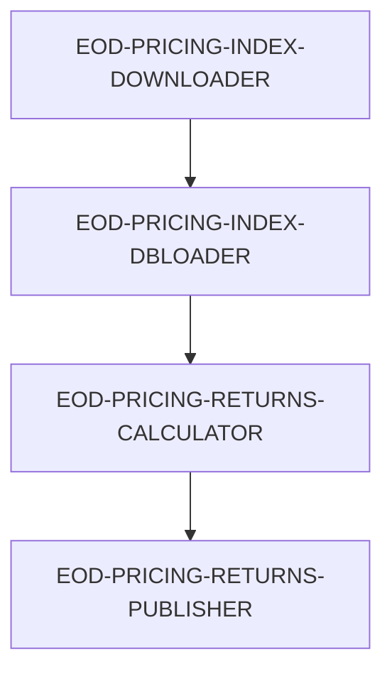

# 💼 Financial Use Case: End-of-Day Processing with EasyTask Scheduler

EasyTask empowers finance teams to orchestrate robust, time-sensitive workflows with precision. This professional-grade solution handles data ingestion, transformation, computation, and publishing in a fully automated and traceable manner.

---

## 📊 Why Use EasyTask for Financial Workflows?

Financial data workflows demand:

* ⏱️ Time-aware scheduling for intraday & EOD tasks
* 📅 Awareness of trading holidays
* 🧵 Sequenced dependencies between jobs
* 💾 Integration with databases and queues (e.g., RabbitMQ)

**EasyTask provides:**

* ✅ Flexible task definitions with timeouts, retries, and user privileges
* ✅ Dependency-aware task group scheduling
* ✅ Holiday-aware triggers using business calendars
* ✅ Profile sourcing for date-based variables

---

## 🧪 Use Case: EOD Processing for 5 US Stocks

**Assets**: AAPL, MSFT, GOOG, META, ORCL
**Objective**:

1. 📥 Download EOD stock and index data
2. 🗃️ Load it into SQLite
3. 📈 Compute returns and beta
4. 📤 Publish beta values to RabbitMQ

---

## 🔗 Task Group Dependency Graph



---

## 🧩 Task Group Definitions

### 🔽 EOD-PRICING-INDEX-DOWNLOADER

Downloads EOD stock and index data.

```json
{
  "gid": 3000001,
  "name": "EOD-PRICING-INDEX-DOWNLOADER",
  "day_of_week": "1111100",
  "description": "Group of tasks to download Pricing and Index data for a set of stocks listed in US Equities markets",
  "timezone": "US/Eastern",
  "trigger_times": "11:15",
  "active": true,
  "instance": "default"
}
```

### 🧳 EOD-PRICING-INDEX-DBLOADER

Loads downloaded data into a SQLite database.

```json
{
  "gid": 3000002,
  "name": "EOD-PRICING-INDEX-DBLOADER",
  "day_of_week": "1111100",
  "description": "Group of tasks to load data into SQLITE database files",
  "timezone": "US/Eastern",
  "trigger_times": "11:15",
  "dependency": "(S:EOD-PRICING-INDEX-DOWNLOADER)",
  "active": true,
  "instance": "default"
}
```

### 📈 EOD-PRICING-RETURNS-CALCULATOR

Calculates daily returns and beta values.

```json
{
  "gid": 3000003,
  "name": "EOD-PRICING-RETURNS-CALCULATOR",
  "day_of_week": "1111100",
  "description": "Group of tasks that calculate stock and index returns",
  "timezone": "US/Eastern",
  "trigger_times": "11:15",
  "dependency": "(S:EOD-PRICING-INDEX-DBLOADER)",
  "active": true,
  "instance": "default"
}
```

### 📤 EOD-PRICING-RETURNS-PUBLISHER

Publishes computed beta values.

```json
{
  "gid": 3000005,
  "name": "EOD-PRICING-RETURNS-PUBLISHER",
  "day_of_week": "1111100",
  "description": "Publishes beta values to RabbitMQ",
  "timezone": "US/Eastern",
  "trigger_times": "11:15",
  "dependency": "(S:EOD-PRICING-RETURNS-CALCULATOR)",
  "active": true,
  "instance": "default"
}
```

---

## 🔧 Key Task Definitions

Each task includes:

* Shell command with variable interpolation
* Execution user & host
* Timeout and retry logic
* Holiday calendar linkage

### 📥 DOWNLOAD\_STOCK\_PRICING

```json
{
  "tid": 1000001,
  "name": "DOWNLOAD_STOCK_PRICING",
  "task_owner": "admin",
  "task_group": "EOD-PRICING-INDEX-DOWNLOADER",
  "cmd": "cd $HOME; python ./eod_pricing_download.py -d ${YYYYMMDD}",
  "run_on_host": "dev1",
  "run_as_user": "etadmin",
  "max_run_time": 15,
  "description": "Download EOD pricing for our US Stock universe",
  "retry_attempts": 2,
  "stdout": "/tmp/download_pricing.out.${YYYYMMDD}",
  "stderr": "/tmp/download_pricing.err.${YYYYMMDD}",
  "profile": "~/.profile",
  "calendar": "US_HOLIDAYS",
  "active": true,
  "task_accept_expiry_time": 10,
  "instance": "default"
}
```

### 📥 DOWNLOAD\_INDEX\_DATA

```json
{
  "tid": 1000002,
  "name": "DOWNLOAD_INDEX_DATA",
  "task_owner": "admin",
  "task_group": "EOD-PRICING-INDEX-DOWNLOADER",
  "cmd": "cd $HOME; python ./eod_index_download.py -d ${YYYYMMDD}",
  "run_on_host": "dev1",
  "run_as_user": "etadmin",
  "max_run_time": 15,
  "description": "Download index data",
  "retry_attempts": 2,
  "stdout": "/tmp/download_index.out.${YYYYMMDD}",
  "stderr": "/tmp/download_index.err.${YYYYMMDD}",
  "profile": "~/.profile",
  "calendar": "US_HOLIDAYS",
  "active": true,
  "task_accept_expiry_time": 10,
  "instance": "default"
}
```

### 🗃️ DBLOAD\_STOCK\_DATA

```json
{
  "tid": 1000003,
  "name": "DBLOAD_STOCK_DATA",
  "task_owner": "admin",
  "task_group": "EOD-PRICING-INDEX-DBLOADER",
  "cmd": "./db_stock_load.py -d ${YYYYMMDD}",
  "run_on_host": "dev1",
  "run_as_user": "evolveadmin",
  "max_run_time": 180,
  "description": "Load stock data to sqlite",
  "retry_attempts": 3,
  "stdout": "/tmp/db_stock_load.log.${YYYYMMDD}",
  "stderr": "/tmp/db_stock_load.err.${YYYYMMDD}",
  "profile": "~/.profile",
  "calendar": "US_HOLIDAYS",
  "active": true,
  "instance": "default"
}
```

### 🗃️ DBLOAD\_INDEX\_DATA

```json
{
  "tid": 1000004,
  "name": "DBLOAD_INDEX_DATA",
  "task_owner": "admin",
  "task_group": "EOD-PRICING-INDEX-DBLOADER",
  "cmd": "./db_index_load.py -d ${YYYYMMDD}",
  "run_on_host": "dev1",
  "run_as_user": "evolveadmin",
  "max_run_time": 180,
  "description": "Load index data to sqlite",
  "retry_attempts": 3,
  "stdout": "/tmp/db_index_load.log.${YYYYMMDD}",
  "stderr": "/tmp/db_index_load.err.${YYYYMMDD}",
  "profile": "~/.profile",
  "calendar": "US_HOLIDAYS",
  "active": true,
  "instance": "default"
}
```

### 📈 CALC\_STOCK\_INDEX\_RETURNS

```json
{
  "tid": 1000005,
  "name": "CALC_STOCK_INDEX_RETURNS",
  "task_owner": "admin",
  "task_group": "EOD-PRICING-RETURNS-CALCULATOR",
  "cmd": "./calc_stock_index_returns.py -d ${YYYYMMDD}",
  "run_on_host": "dev1",
  "run_as_user": "evolveadmin",
  "max_run_time": 180,
  "description": "Calculate daily stock and index returns",
  "retry_attempts": 3,
  "stdout": "/tmp/calc_stock_index_returns.log.${YYYYMMDD}",
  "stderr": "/tmp/calc_stock_index_returns.err.${YYYYMMDD}",
  "profile": "~/.profile",
  "calendar": "US_HOLIDAYS",
  "active": true,
  "instance": "default"
}
```

### 📈 CALC\_STOCK\_BETA

```json
{
  "tid": 1000006,
  "name": "CALC_STOCK_BETA",
  "task_owner": "admin",
  "task_group": "EOD-PRICING-RETURNS-CALCULATOR",
  "cmd": "./calc_stock_beta.py -d ${YYYYMMDD}",
  "run_on_host": "dev1",
  "run_as_user": "evolveadmin",
  "max_run_time": 180,
  "description": "Calculate beta metrics for stocks",
  "retry_attempts": 3,
  "stdout": "/tmp/calc_stock_beta.log.${YYYYMMDD}",
  "stderr": "/tmp/calc_stock_beta.err.${YYYYMMDD}",
  "profile": "~/.profile",
  "calendar": "US_HOLIDAYS",
  "active": true,
  "instance": "default"
}
```

### 📤 PUBLISH\_BETA

```json
{
  "tid": 1000007,
  "name": "PUBLISH_BETA",
  "task_owner": "admin",
  "task_group": "EOD-PRICING-RETURNS-PUBLISHER",
  "cmd": "./publish_beta.py -d ${YYYYMMDD}",
  "run_on_host": "dev1",
  "run_as_user": "evolveadmin",
  "max_run_time": 180,
  "description": "Publish beta metrics to RabbitMQ",
  "retry_attempts": 3,
  "stdout": "/tmp/publish_beta.log.${YYYYMMDD}",
  "stderr": "/tmp/publish_beta.err.${YYYYMMDD}",
  "profile": "~/.profile",
  "calendar": "US_HOLIDAYS",
  "active": true,
  "instance": "default"
}
```

```json
{
  "tid": 1000001,
  "name": "DOWNLOAD_STOCK_PRICING",
  "task_group": "EOD-PRICING-INDEX-DOWNLOADER",
  "cmd": "cd $HOME; python ./eod_pricing_download.py -d ${YYYYMMDD}",
  "run_on_host": "dev1",
  "run_as_user": "etadmin",
  "calendar": "US_HOLIDAYS",
  "active": true
}
```

---

## 🐍 Python Task Script Samples

### `eod_pricing_download.py`

```python
import yfinance as yf
import datetime

stocks = ["AAPL", "MSFT", "GOOG", "META", "ORCL"]
end = datetime.date.today()
start = end - datetime.timedelta(days=1)

data = {s: yf.download(s, start=start, end=end) for s in stocks}

for sym, df in data.items():
    df.to_csv(f"{sym}_eod.csv")
```

### `eod_index_download.py`

```python
import yfinance as yf
import datetime

indexes = ["^GSPC"]
end = datetime.date.today()
start = end - datetime.timedelta(days=1)

data = {i: yf.download(i, start=start, end=end) for i in indexes}

for sym, df in data.items():
    df.to_csv(f"{sym}_index.csv")
```

### `db_stock_load.py`

```python
import sqlite3
import pandas as pd
import glob

conn = sqlite3.connect("pricing.db")
c = conn.cursor()
c.execute("CREATE TABLE IF NOT EXISTS pricing (ticker TEXT, date TEXT, close REAL)")

for file in glob.glob("*_eod.csv"):
    df = pd.read_csv(file)
    ticker = file.split("_")[0]
    for _, row in df.iterrows():
        c.execute("INSERT INTO pricing VALUES (?, ?, ?)", (ticker, row['Date'], row['Close']))

conn.commit()
conn.close()
```

### `db_index_load.py`

```python
import sqlite3
import pandas as pd

conn = sqlite3.connect("pricing.db")
c = conn.cursor()
c.execute("CREATE TABLE IF NOT EXISTS index_pricing (index TEXT, date TEXT, close REAL)")

df = pd.read_csv("^GSPC_index.csv")
for _, row in df.iterrows():
    c.execute("INSERT INTO index_pricing VALUES (?, ?, ?)", ("^GSPC", row['Date'], row['Close']))

conn.commit()
conn.close()
```

### `calc_stock_index_returns.py`

```python
import sqlite3
import pandas as pd

conn = sqlite3.connect("pricing.db")
returns = {}
for table, key in [("pricing", "ticker"), ("index_pricing", "index")]:
    df = pd.read_sql_query(f"SELECT * FROM {table}", conn)
    if not df.empty:
        grouped = df.groupby(key)
        for sym, group in grouped:
            group = group.sort_values("date")
            if len(group) >= 2:
                r = (group['close'].iloc[-1] - group['close'].iloc[-2]) / group['close'].iloc[-2]
                returns[sym] = round(r, 6)
print("Returns:", returns)
conn.close()
```

### `calc_stock_beta.py`

```python
import pandas as pd
import sqlite3
import os
import datetime

conn = sqlite3.connect("pricing.db")
stocks = pd.read_sql("SELECT * FROM pricing", conn)
index = pd.read_sql("SELECT * FROM index_pricing", conn)
conn.close()

betas = {}
for sym in stocks['ticker'].unique():
    s = stocks[stocks['ticker'] == sym].sort_values('date')
    i = index.sort_values('date')
    if len(s) >= 2 and len(i) >= 2:
        s_ret = s['close'].pct_change().dropna()
        i_ret = i['close'].pct_change().dropna()
        beta = s_ret.cov(i_ret) / i_ret.var()
        betas[sym] = round(beta, 6)

os.makedirs(os.path.expanduser("~/beta"), exist_ok=True)
date_str = datetime.date.today().strftime("%Y%m%d")
with open(os.path.expanduser(f"~/beta/beta.{date_str}.dat"), "w") as f:
    for sym, b in betas.items():
        f.write(f"{sym},{b}\n")
```

### `publish_beta.py`

```python
import pika
import os
import datetime

queue_name = "beta_metrics"
date_str = datetime.date.today().strftime("%Y%m%d")
filepath = os.path.expanduser(f"~/beta/beta.{date_str}.dat")

conn = pika.BlockingConnection(pika.ConnectionParameters('localhost'))
channel = conn.channel()
channel.queue_declare(queue=queue_name)

with open(filepath) as f:
    for line in f:
        sym, beta = line.strip().split(',')
        payload = f'{{"symbol": "{sym}", "beta": {beta}}}'
        channel.basic_publish(exchange='', routing_key=queue_name, body=payload)
        print(f"[x] Published {payload}")

conn.close()
```

---

## 📁 Shell Profile

```bash
# ~/.profile
export YYYYMMDD=$(date +"%Y%m%d")
```

---

## 📅 Business Calendar: US\_HOLIDAYS

Used to skip scheduling on US market holidays. Can be configured via the EasyTask web UI.

---

## ✅ Summary

This example demonstrates how EasyTask can automate a complex, multi-stage financial data pipeline with:

* Reliable scheduling
* Business calendar alignment
* Secure user-level execution
* Native integration with messaging systems

Ideal for **quant teams**, **data engineers**, and **trading infrastructure** use cases.

---

## Frequently Asked Questions

**Q: Can I use a different database instead of SQLite?**
A: Yes, replace the SQLite connection logic in the Python scripts with your preferred database connector (PostgreSQL, MySQL, etc.).

**Q: How do I add more stocks to the universe?**
A: Simply add ticker symbols to the `stocks` list in the `eod_pricing_download.py` script and create corresponding task definitions.

**Q: How do I handle failed tasks in the pipeline?**
A: Configure retry attempts in each task definition and use alert integrations (Slack, email) to get notified on failures.

---

## Next Steps

- [Accounting Use Case](accounting.md) - Month-end accounting workflow example
- [Insurance Use Case](insurance.md) - Insurance claims processing example
- [Insert Task](../easytask_cli/database_operations/task/insert_task.md) - Learn how to insert tasks via CLI
