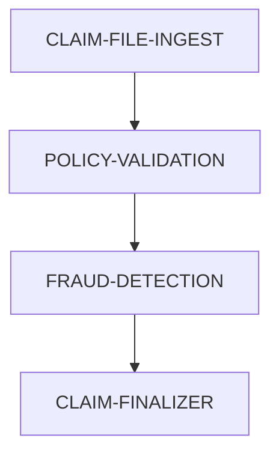

## 🛡️ Use Case: Insurance Claims Batch Processing

This use case demonstrates how EasyTask can be used in the insurance sector to automate claim ingestion, policy validation, fraud checks, and final approvals.

**Objective**:

1. 📥 Ingest daily insurance claim files from SFTP
2. 📑 Validate each claim against policy database
3. 🔍 Run fraud detection heuristics
4. ✅ Mark eligible claims for payment

---

## 🔗 Claims Workflow Dependency Graph



---

## 🧩 Task Group Definitions for Insurance Workflow

### 📂 CLAIM-FILE-INGEST

```json
{
  "gid": 5000001,
  "name": "CLAIM-FILE-INGEST",
  "description": "Pull claim files from SFTP daily",
  "trigger_times": "06:30",
  "timezone": "US/Eastern",
  "day_of_week": "1111100",
  "active": true,
  "instance": "default"
}
```

### 📘 POLICY-VALIDATION

```json
{
  "gid": 5000002,
  "name": "POLICY-VALIDATION",
  "description": "Validate claims against policy DB",
  "dependency": "(S:CLAIM-FILE-INGEST)",
  "trigger_times": "06:45",
  "timezone": "US/Eastern",
  "day_of_week": "1111100",
  "active": true,
  "instance": "default"
}
```

### 🔎 FRAUD-DETECTION

```json
{
  "gid": 5000003,
  "name": "FRAUD-DETECTION",
  "description": "Run ML fraud checks on claims",
  "dependency": "(S:POLICY-VALIDATION)",
  "trigger_times": "07:00",
  "timezone": "US/Eastern",
  "day_of_week": "1111100",
  "active": true,
  "instance": "default"
}
```

### ✅ CLAIM-FINALIZER

```json
{
  "gid": 5000004,
  "name": "CLAIM-FINALIZER",
  "description": "Mark valid claims ready for approval",
  "dependency": "(S:FRAUD-DETECTION)",
  "trigger_times": "07:15",
  "timezone": "US/Eastern",
  "day_of_week": "1111100",
  "active": true,
  "instance": "default"
}
```

---

## 🔧 Task Definitions for Insurance Workflow

### ⬇️ DOWNLOAD\_CLAIM\_FILES

```json
{
  "tid": 2000001,
  "name": "DOWNLOAD_CLAIM_FILES",
  "task_group": "CLAIM-FILE-INGEST",
  "cmd": "./fetch_claims_from_sftp.sh",
  "run_on_host": "infra-node-1",
  "run_as_user": "insadmin",
  "description": "Pull daily claim files from secure SFTP",
  "retry_attempts": 3,
  "max_run_time": 120,
  "stdout": "/logs/claims_download.out",
  "stderr": "/logs/claims_download.err",
  "profile": "~/.profile",
  "calendar": "US_HOLIDAYS",
  "active": true,
  "instance": "default"
}
```

### 🧾 VALIDATE\_POLICY\_DATA

```json
{
  "tid": 2000002,
  "name": "VALIDATE_POLICY_DATA",
  "task_group": "POLICY-VALIDATION",
  "cmd": "python ./validate_policy.py -d ${YYYYMMDD}",
  "run_on_host": "infra-node-2",
  "run_as_user": "claimsops",
  "description": "Check policy and coverage against DB",
  "retry_attempts": 3,
  "max_run_time": 180,
  "stdout": "/logs/policy_validate.out",
  "stderr": "/logs/policy_validate.err",
  "profile": "~/.profile",
  "calendar": "US_HOLIDAYS",
  "active": true,
  "instance": "default"
}
```

### 🔍 RUN\_FRAUD\_CHECKS

```json
{
  "tid": 2000003,
  "name": "RUN_FRAUD_CHECKS",
  "task_group": "FRAUD-DETECTION",
  "cmd": "python ./fraud_detection.py -d ${YYYYMMDD}",
  "run_on_host": "infra-node-ml",
  "run_as_user": "frauduser",
  "description": "Run ML fraud detection on claims",
  "retry_attempts": 2,
  "max_run_time": 300,
  "stdout": "/logs/fraud_check.out",
  "stderr": "/logs/fraud_check.err",
  "profile": "~/.profile",
  "calendar": "US_HOLIDAYS",
  "active": true,
  "instance": "default"
}
```

### 📝 FINALIZE\_ELIGIBLE\_CLAIMS

```json
{
  "tid": 2000004,
  "name": "FINALIZE_ELIGIBLE_CLAIMS",
  "task_group": "CLAIM-FINALIZER",
  "cmd": "python ./finalize_claims.py -d ${YYYYMMDD}",
  "run_on_host": "infra-node-1",
  "run_as_user": "claimsadmin",
  "description": "Mark eligible claims for payout queue",
  "retry_attempts": 2,
  "max_run_time": 150,
  "stdout": "/logs/finalize.out",
  "stderr": "/logs/finalize.err",
  "profile": "~/.profile",
  "calendar": "US_HOLIDAYS",
  "active": true,
  "instance": "default"
}
```

---

## 🐍 Insurance Python Task Scripts

### `fetch_claims_from_sftp.sh`

```bash
#!/bin/bash
HOST='sftp.insuranceco.com'
USER='sftp_user'
KEY='/home/insadmin/.ssh/id_rsa'
TARGET='/data/claims/incoming'
LOCAL='/home/insadmin/claims_downloads'

date=$(date +%Y%m%d)
mkdir -p "$LOCAL/$date"
sftp -i $KEY $USER@$HOST <<EOF
lcd $LOCAL/$date
cd $TARGET
mget *.csv
bye
EOF
```

### `validate_policy.py`

```python
import pandas as pd
import sqlite3
import sys

date = sys.argv[sys.argv.index("-d") + 1]
df = pd.read_csv(f"claims_downloads/{date}/claims.csv")
conn = sqlite3.connect("/data/policies/policy.db")
validated = []

for _, row in df.iterrows():
    policy_id = row["policy_id"]
    cursor = conn.execute("SELECT 1 FROM policies WHERE policy_id=?", (policy_id,))
    if cursor.fetchone():
        validated.append(row)

pd.DataFrame(validated).to_csv(f"validated_claims_{date}.csv", index=False)
conn.close()
```

### `fraud_detection.py`

```python
import pandas as pd
import sys
from sklearn.ensemble import IsolationForest

# Fake fraud detection model

date = sys.argv[sys.argv.index("-d") + 1]
df = pd.read_csv(f"validated_claims_{date}.csv")
model = IsolationForest(random_state=42)
df['fraud_score'] = model.fit_predict(df.select_dtypes(include='number'))
df[df['fraud_score'] == 1].to_csv(f"eligible_claims_{date}.csv", index=False)
```

### `finalize_claims.py`

```python
import pandas as pd
import sys
import datetime

date = sys.argv[sys.argv.index("-d") + 1]
df = pd.read_csv(f"eligible_claims_{date}.csv")
df["approved"] = True
df.to_csv(f"approved_claims_{date}.csv", index=False)

with open(f"approved_summary_{date}.log", "w") as log:
    log.write(f"✅ {len(df)} claims marked approved on {datetime.datetime.now()}
")
```

---

## Frequently Asked Questions

**Q: How do I customize the fraud detection model?**
A: Replace the IsolationForest model in `fraud_detection.py` with your own ML model or rule-based system for fraud scoring.

**Q: Can I integrate with external claims management systems?**
A: Yes, modify the `finalize_claims.py` script to push approved claims to your claims management system via API or database writes.

**Q: How do I handle large claim volumes?**
A: Increase `max_run_time` in task definitions and consider parallelizing validation across multiple task instances.

---

## Next Steps

- [Finance Use Case](finance.md) - End-of-day financial data processing example
- [Pharma Use Case](pharma.md) - Clinical trial data processing example
- [Insert Task](../easytask_cli/database_operations/task/insert_task.md) - Learn how to insert tasks via CLI
