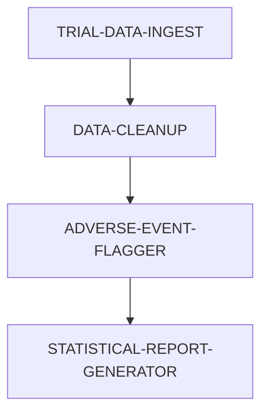


---
title: Pharma Clinical Trial Data Processing - EasyTask Documentation
description: Automate pharmaceutical clinical trial workflows with EasyTask including data ingestion, cleaning, adverse event flagging, and statistical reporting.
keywords:
  - pharma workflow
  - easytask
  - clinical trial
  - adverse events
  - data pipeline
---

## 🧬 Use Case: Clinical Trial Data Processing in Pharma

This use case shows how EasyTask helps pharmaceutical research teams orchestrate clinical trial workflows, involving data ingestion, cleaning, adverse event flagging, and statistical analysis.

**Objective**:

1. 📥 Ingest CSV data from trial sites daily
2. 🧹 Clean and normalize the data
3. ⚠️ Flag adverse events for medical review
4. 📊 Run statistical summaries and export reports

---

## 🔗 Pharma Workflow Dependency Graph



---

## 🧩 Task Group Definitions for Pharma Use Case

### 🧾 TRIAL-DATA-INGEST

```json
{
  "gid": 6000001,
  "name": "TRIAL-DATA-INGEST",
  "description": "Pull trial data from SFTP",
  "trigger_times": "20:00",
  "timezone": "US/Eastern",
  "day_of_week": "1111110",
  "active": true,
  "instance": "default"
}
```

### 🧼 DATA-CLEANUP

```json
{
  "gid": 6000002,
  "name": "DATA-CLEANUP",
  "description": "Normalize and clean data",
  "dependency": "(S:TRIAL-DATA-INGEST)",
  "trigger_times": "20:30",
  "timezone": "US/Eastern",
  "active": true,
  "instance": "default"
}
```

### 🚨 ADVERSE-EVENT-FLAGGER

```json
{
  "gid": 6000003,
  "name": "ADVERSE-EVENT-FLAGGER",
  "description": "Detect adverse events",
  "dependency": "(S:DATA-CLEANUP)",
  "trigger_times": "20:45",
  "timezone": "US/Eastern",
  "active": true,
  "instance": "default"
}
```

### 📈 STATISTICAL-REPORT-GENERATOR

```json
{
  "gid": 6000004,
  "name": "STATISTICAL-REPORT-GENERATOR",
  "description": "Generate daily trial stats",
  "dependency": "(S:ADVERSE-EVENT-FLAGGER)",
  "trigger_times": "21:00",
  "timezone": "US/Eastern",
  "active": true,
  "instance": "default"
}
```

---

## 🔧 Task Definitions for Pharma Use Case

### ⬇️ DOWNLOAD\_TRIAL\_DATA

```json
{
  "tid": 3000001,
  "name": "DOWNLOAD_TRIAL_DATA",
  "task_group": "TRIAL-DATA-INGEST",
  "cmd": "./download_trial_data.sh",
  "run_on_host": "pharma-node1",
  "run_as_user": "ctmsadmin",
  "description": "Download trial data from remote site",
  "retry_attempts": 2,
  "max_run_time": 120,
  "stdout": "/logs/trial_data.out",
  "stderr": "/logs/trial_data.err",
  "profile": "~/.profile",
  "active": true,
  "instance": "default"
}
```

### 🧹 CLEAN\_TRIAL\_DATA

```json
{
  "tid": 3000002,
  "name": "CLEAN_TRIAL_DATA",
  "task_group": "DATA-CLEANUP",
  "cmd": "python ./clean_data.py -d ${YYYYMMDD}",
  "run_on_host": "pharma-node2",
  "run_as_user": "dataeng",
  "description": "Apply normalizations and remove errors",
  "retry_attempts": 3,
  "max_run_time": 150,
  "stdout": "/logs/clean_data.out",
  "stderr": "/logs/clean_data.err",
  "profile": "~/.profile",
  "active": true,
  "instance": "default"
}
```

### ⚠️ FLAG\_ADVERSE\_EVENTS

```json
{
  "tid": 3000003,
  "name": "FLAG_ADVERSE_EVENTS",
  "task_group": "ADVERSE-EVENT-FLAGGER",
  "cmd": "python ./flag_ae.py -d ${YYYYMMDD}",
  "run_on_host": "pharma-node2",
  "run_as_user": "safetyops",
  "description": "Scan data for adverse event keywords",
  "retry_attempts": 2,
  "max_run_time": 100,
  "stdout": "/logs/flag_ae.out",
  "stderr": "/logs/flag_ae.err",
  "profile": "~/.profile",
  "active": true,
  "instance": "default"
}
```

### 📊 GENERATE\_STAT\_REPORT

```json
{
  "tid": 3000004,
  "name": "GENERATE_STAT_REPORT",
  "task_group": "STATISTICAL-REPORT-GENERATOR",
  "cmd": "python ./generate_report.py -d ${YYYYMMDD}",
  "run_on_host": "pharma-node3",
  "run_as_user": "biostat",
  "description": "Summarize trial metrics and output CSV",
  "retry_attempts": 2,
  "max_run_time": 180,
  "stdout": "/reports/statistics.out",
  "stderr": "/reports/statistics.err",
  "profile": "~/.profile",
  "active": true,
  "instance": "default"
}
```

---

## 🐍 Pharma Python Task Scripts

### `download_trial_data.sh`

```bash
#!/bin/bash
sftp_user='pharma_trial_user'
sftp_host='sftp.pharma.org'
local_dir="/data/trial/raw/$(date +%Y%m%d)"
remote_dir="/outgoing/clinical_trials"
mkdir -p $local_dir
sftp $sftp_user@$sftp_host <<EOF
lcd $local_dir
cd $remote_dir
mget *.csv
bye
EOF
```

### `clean_data.py`

```python
import pandas as pd
import sys

date = sys.argv[sys.argv.index("-d") + 1]
df = pd.read_csv(f"/data/trial/raw/{date}/raw_data.csv")
df.dropna(inplace=True)
df.columns = [col.strip().lower().replace(" ", "_") for col in df.columns]
df.to_csv(f"/data/trial/cleaned/cleaned_{date}.csv", index=False)
```

### `flag_ae.py`

```python
import pandas as pd
import sys
import re

date = sys.argv[sys.argv.index("-d") + 1]
df = pd.read_csv(f"/data/trial/cleaned/cleaned_{date}.csv")
keywords = ["rash", "nausea", "headache", "fever"]

def has_adverse_event(notes):
    return any(re.search(kw, notes, re.IGNORECASE) for kw in keywords)

df["flagged"] = df["notes"].apply(lambda x: has_adverse_event(str(x)))
df[df["flagged"]].to_csv(f"/data/trial/adverse/ae_{date}.csv", index=False)
```

### `generate_report.py`

```python
import pandas as pd
import sys

date = sys.argv[sys.argv.index("-d") + 1]
df = pd.read_csv(f"/data/trial/cleaned/cleaned_{date}.csv")
report = df.describe(include='all')
report.to_csv(f"/data/trial/reports/report_summary_{date}.csv")
```

---

## Frequently Asked Questions

**Q: How do I add more adverse event keywords for flagging?**
A: Update the `keywords` list in `flag_ae.py` with additional medical terms relevant to your clinical trial protocol.

**Q: Can I integrate with CDISC or other clinical data standards?**
A: Yes, modify the data cleaning script to transform incoming data into CDISC format before processing.

**Q: How do I secure SFTP credentials for trial data ingestion?**
A: Store credentials in a secrets manager or use SSH key-based authentication as shown in the download script.

---

## Next Steps

- [Insurance Use Case](insurance.md) - Insurance claims processing example
- [Finance Use Case](finance.md) - End-of-day financial data processing example
- [Insert Task Group](../easytask_cli/database_operations/taskgroup/insert_taskgroup.md) - Learn how to create task groups