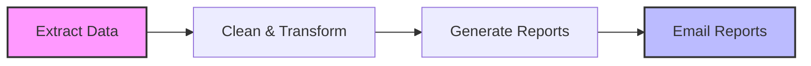
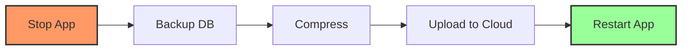
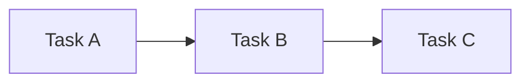
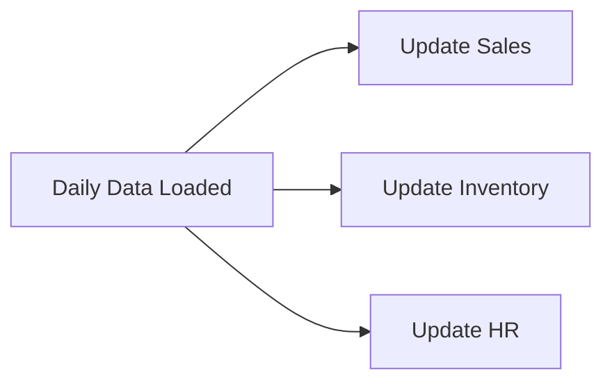
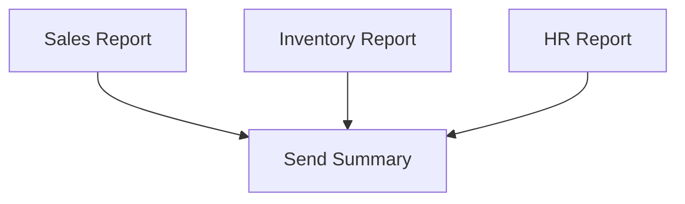
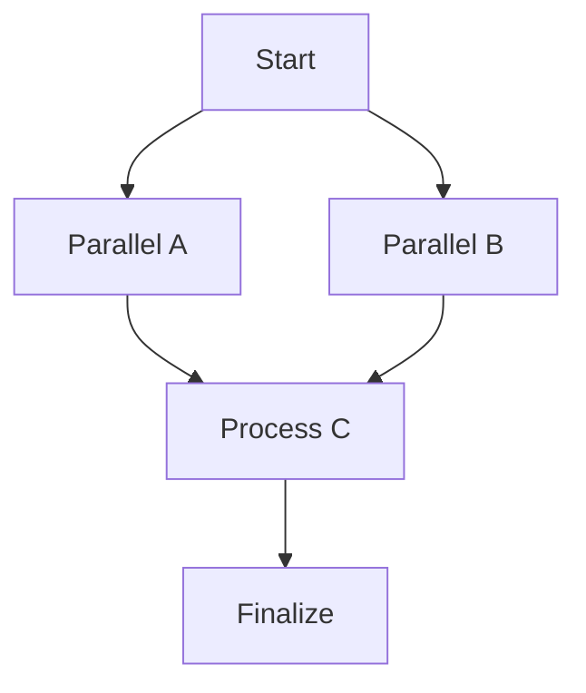
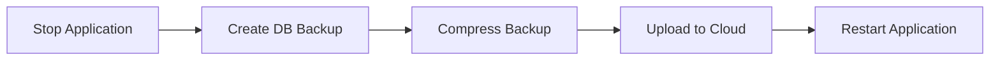

# Task Dependencies Guide

Task dependencies are like dominoes - one task must complete successfully before the next one can start. This guide explains how to create powerful workflows using task dependencies.

## 🔑 Critical Dependency Rules

### The #1 Rule: Dependency Scope

**Tasks can ONLY depend on other tasks within the SAME task group**

This is a fundamental architectural constraint:
- ✅ **Tasks** can depend on other **tasks** in the same task group
- ✅ **Task groups** can depend on other **task groups**
- ❌ **Tasks CANNOT** depend on tasks in different groups
- ❌ **Tasks CANNOT** depend on standalone tasks
- ❌ **Task groups CANNOT** depend on individual tasks

### Mutual Exclusivity Principle

**IMPORTANT:** Dependencies are ONLY available for task group tasks, NOT for single tasks:

- **Single Tasks:** Cannot have dependencies, use time-based scheduling instead
- **Task Group Tasks:** Can have dependencies, inherit scheduling from group

### Validation Rules

The system enforces these rules strictly:

1. **Task Dependency Validation:**
   - ✅ Task must have `task_group` field
   - ✅ Referenced task must exist in system
   - ✅ Referenced task must be in SAME `task_group`
   - ✅ No circular dependencies within group
   - ❌ Cannot reference tasks from other groups
   - ❌ Cannot reference standalone tasks

2. **Task Group Dependency Validation:**
   - ✅ Referenced group must exist in system
   - ✅ No circular group dependencies
   - ❌ Cannot reference individual tasks
   - ❌ Cannot reference non-existent groups

3. **Standalone Task Rules:**
   - ✅ Can have independent schedules
   - ❌ Cannot have `dependency` field at all
   - ❌ Cannot be referenced by other tasks

---

## What Are Task Dependencies?

Think of dependencies like a recipe:

1. **First:** Preheat the oven (Task A)

2. **Then:** Mix the ingredients (Task B) - can only start after oven is ready

3. **Finally:** Bake the cake (Task C) - can only start after ingredients are mixed

In EasyTask, you can create similar chains where Task B waits for Task A to finish successfully before starting.

## Why Use Dependencies?

### Real-World Examples

#### Data Processing Pipeline
A classic sequence where each step relies on the output of the previous one.



#### Backup Workflow
A critical maintenance chain ensuring data safety before bringing systems back online.



## Understanding the Dependency System

### The "Prerequisite" Concept
Think of dependencies as **rules of order**. Just like you can't put on shoes before your socks, some tasks essentially wait for others.

- **The Prerequisite (Parent)**: The task that must happen *first*.
- **The Dependent (Child)**: The task that *waits*.

### Dependency Types Visualized

#### 1. Simple Chain
The "Domino Effect". Task B waits for A. Task C waits for B.



#### 2. Fan-Out (One triggers many)
A single event kicks off multiple parallel processes. For example, "Daily Data Arrives" triggers "Update Sales", "Update Inventory", and "Update HR".



#### 3. Fan-In (Many trigger one)
A "bottleneck" where a task waits for several others to all finish. "Send Summary Email" runs only after *all* departmental reports are ready.



#### 4. Complex Graph
Real workflows often mix these patterns together.



---

## Dependency Syntax and Examples

### Dependency Format

Dependencies use a simple expression format:

```
(STATE:TASK_NAME) [operator] (STATE:TASK_NAME)
```

### Available Task States

| Code | State | Badge Color | Description |
|:----:|:-------|:-----------:|:-------------|
| **I** | IDLE | 🟨 Yellow | Task is waiting to run |
| **A** | ACTIVE | 🟩 Green | Task is active/queued |
| **Z** | TRIGGER | 🟦 Blue | Task is being triggered |
| **D** | STARTED | 🟦 Cyan | Task has started execution |
| **R** | RUNNING | 🟦 Blue | Task is currently running |
| **F** | FAILED | 🟥 Red | Task execution failed |
| **S** | SUCCESS | 🟩 Green | Task completed successfully |
| **T** | TERMINATED | ⬛ Black | Task was manually terminated |
| **E** | REJECTED | ⬛ Gray | Task was rejected |
| **G** | RESTARTING | 🟠 Orange | Task is restarting |
| **O** | FREEZE | 🧊 Light Blue | Task is frozen |
| **U** | UNFREEZE | 💧 Light Blue | Task is unfrozen |

### Logical Operators

- `and`: Both conditions must be true
- `or`: At least one condition must be true
- `not`: Invert the condition
- `()`: Grouping for precedence

### Dependency Examples

```json
// Simple dependency - wait for success
"dependency": "(S:extract_data)"

// Wait for multiple tasks to succeed
"dependency": "(S:task1) and (S:task2)"

// Wait for either task to succeed
"dependency": "(S:task1) or (S:task2)"

// Complex logic
"dependency": "(S:task1) and ((S:task2) or (S:task3))"

// Wait for failure
"dependency": "(F:error_task)"

// Mixed conditions
"dependency": "(S:extract) and not (F:validate)"
```

---

## Setting Up Dependencies

### Method 1: Simple Chain



#### Step 1: Create a Task Group
```json
{
  "gid": 3000001,
  "name": "backup-workflow",
  "description": "Complete backup process",
  "day_of_week": "1111111",
  "trigger_times": "02:00",
  "timezone": "UTC",
  "active": true
}
```

#### Step 2: Create Tasks in Order

**Task 1 - No dependency (first in chain):**
```json
{
  "tid": 200001,
  "name": "stop-application",
  "task_owner": "ops_team",
  "task_group": "backup-workflow",
  "description": "Stop the application gracefully",
  "cmd": "systemctl stop myapp",
  "run_on_host": "app-server",
  "run_as_user": "app_user",
  "stdout": "/logs/stop_app.out",
  "stderr": "/logs/stop_app.err",
  "max_run_time": 60,
  "active": true
}
```

**Task 2 - Depends on Task 1:**
```json
{
  "tid": 200002,
  "name": "backup-database",
  "task_owner": "ops_team",
  "task_group": "backup-workflow",
  "description": "Create database backup",
  "cmd": "pg_dump -U admin mydb > /backups/backup_$(date +%Y%m%d).sql",
  "run_on_host": "app-server",
  "run_as_user": "db_user",
  "dependency": "(S:stop-application)",
  "stdout": "/logs/backup.out",
  "stderr": "/logs/backup.err",
  "max_run_time": 1800,
  "active": true
}
```

**Task 3 - Depends on Task 2:**
```json
{
  "tid": 200003,
  "name": "compress-backup",
  "task_owner": "ops_team",
  "task_group": "backup-workflow",
  "description": "Compress the backup file",
  "cmd": "gzip /backups/backup_$(date +%Y%m%d).sql",
  "run_on_host": "app-server",
  "run_as_user": "backup_user",
  "dependency": "(S:backup-database)",
  "stdout": "/logs/compress.out",
  "stderr": "/logs/compress.err",
  "max_run_time": 300,
  "active": true
}
```

**Task 4 - Depends on Task 3:**
```json
{
  "tid": 200004,
  "name": "restart-application",
  "task_owner": "ops_team",
  "task_group": "backup-workflow",
  "description": "Restart the application",
  "cmd": "systemctl start myapp",
  "run_on_host": "app-server",
  "run_as_user": "app_user",
  "dependency": "(S:compress-backup)",
  "stdout": "/logs/restart.out",
  "stderr": "/logs/restart.err",
  "max_run_time": 120,
  "active": true
}
```

**Result:** Tasks run in order: stop-application → backup-database → compress-backup → restart-application

### Method 2: Fan-Out - Multiple Downstream Tasks

All downstream tasks are triggered as soon as 'stop-application' task completes:

```json
{
  "name": "backup-database",
  "dependency": "(S:stop-application)"
}
```

```json
{
  "name": "backup-config-files",
  "dependency": "(S:stop-application)"
}
```

```json
{
  "name": "backup-logs",
  "dependency": "(S:stop-application)"
}
```

### Method 3: Fan-In - Wait for All Upstream Tasks

A task waits until all upstream tasks are completed:

```json
{
  "name": "restart-application",
  "dependency": "(S:stop-application) and (S:backup-database) and (S:compress-backup)"
}
```

### Method 4: Task Group Dependencies

Task groups can depend on other task groups:

```json
{
  "gid": 3000002,
  "name": "data-processing",
  "description": "Process data after extraction",
  "day_of_week": "1111111",
  "trigger_times": "10:00",
  "timezone": "UTC",
  "dependency": "(S:data-extraction)",
  "active": true
}
```

This task group will only start after the "data-extraction" task group completes successfully.

---

## Valid vs Invalid Dependencies

### ✅ VALID Scenarios

#### Tasks Within Same Group
```json
// Task Group: "data_pipeline"
{
  "gid": 300001,
  "name": "data_pipeline",
  "trigger_times": "10:00"
}

// Task 1: First task
{
  "tid": 200001,
  "name": "extract_data",
  "task_group": "data_pipeline"
  // No dependency
}

// Task 2: Depends on Task 1 (VALID)
{
  "tid": 200002,
  "name": "transform_data",
  "task_group": "data_pipeline",
  "dependency": "(S:extract_data)"  // ✅ VALID: Same group
}

// Task 3: Depends on Tasks 1 & 2 (VALID)
{
  "tid": 200003,
  "name": "load_data",
  "task_group": "data_pipeline",
  "dependency": "(S:extract_data) and (S:transform_data)"  // ✅ VALID: Same group
}
```

#### Task Groups Depending on Other Groups
```json
// Task Group 1
{
  "gid": 300001,
  "name": "data_extraction",
  "dependency": ""
}

// Task Group 2 (depends on Group 1)
{
  "gid": 300002,
  "name": "data_processing",
  "dependency": "(S:data_extraction)"  // ✅ VALID: Group dependency
}
```

### ❌ INVALID Scenarios

#### Cross-Group Task Dependencies
```json
// Task Group A
{
  "gid": 300001,
  "name": "group_a"
}

// Task Group B
{
  "gid": 300002,
  "name": "group_b"
}

// Task in Group A trying to depend on Task in Group B (INVALID)
{
  "tid": 200001,
  "name": "task_in_group_a",
  "task_group": "group_a",
  "dependency": "(S:task_in_group_b)"  // ❌ INVALID: Different groups!
}
```

#### Single Task with Dependencies
```json
// Standalone task cannot have dependencies (INVALID)
{
  "tid": 1000001,
  "name": "standalone_task",
  // No task_group field
  "dependency": "(S:other_task)"  // ❌ INVALID: Single task with dependency!
}
```

#### Task Group Depending on Individual Task
```json
// Task group trying to depend on individual task (INVALID)
{
  "gid": 300001,
  "name": "my_group",
  "dependency": "(S:some_individual_task)"  // ❌ INVALID: Groups can only depend on groups!
}
```

---

## Managing Dependencies with the Dependency Builder

EasyTask features a powerful **Dependency Builder** that makes creating complex workflows intuitive.

### Accessing the Builder
1. **Navigate** to `Tasks` → `Task Definitions`
2. **Edit** an existing task (✏️ icon) or **Add** a new task
3. **Click** the `Dependency` field to open the Dependency Builder Modal

### Modes of Operation

#### 1. Beginner Mode (Template Driven)
Ideal for common patterns:

| Pattern | Logic | Use Case |
|:---|:---|:---|
| **All selected tasks succeed** | `(S:task1) and (S:task2)` | Standard sequential workflow |
| **All selected tasks fail** | `(F:task1) and (F:task2)` | Error handling workflows |
| **Any selected task succeeds** | `(S:task1) or (S:task2)` | Redundancy workflows |
| **Any selected task fails** | `(F:task1) or (F:task2)` | Alerting workflows |

#### 2. Advanced Mode (Expression Editor)
For complex logic with specific states and nested conditions.

**Example Advanced Expression:**
```
(S:extract_data and S:transform_data) or (F:load_data and not S:notify_admin)
```

### Visual Validation
The builder includes live validation for:
- **Syntax Errors**: Invalid brackets or operators
- **Circular Dependencies**: Preventing A → B → A loops
- **Scope Errors**: Ensuring same-group references only
- **Logic Flaws**: Impossible conditions

---

## Best Practices for Dependencies

### ✅ Do's

**Design for Failure:**
- Include error handling tasks
- Set appropriate timeouts
- Use retry attempts for critical steps
- Plan for rollback scenarios

**Keep It Simple:**
- Start with linear workflows (A→B→C)
- Gradually add complexity as needed
- Document your workflow logic
- Use meaningful task names

**Monitor Performance:**
- Set realistic timeouts for each task
- Monitor total workflow duration
- Identify slow steps for optimization
- Use parallel processing when possible

**Test Thoroughly:**
- Test each task individually first
- Test the complete workflow
- Test failure scenarios
- Verify rollback procedures work

**Respect Scope Rules:**
- Always verify tasks are in the same group
- Use task group dependencies for multi-group workflows
- Never try to create cross-group task dependencies
- Remember that single tasks cannot have dependencies

### ❌ Don'ts

**Avoid Common Pitfalls:**
- Don't create circular dependencies (A→B→A)
- Don't make workflows too deep (more than 10 levels)
- Don't ignore error handling
- Don't forget to activate all tasks

**Scope Violations:**
- Don't create dependencies across task groups
- Don't reference standalone tasks from group tasks
- Don't have task groups depend on individual tasks
- Don't forget that dependencies only work within the same group

**Performance Issues:**
- Don't create unnecessary serial dependencies
- Don't run too many parallel tasks simultaneously
- Don't chain quick tasks that could be combined
- Don't ignore resource constraints

---

## Error Handling in Workflows

### What Happens When a Task Fails?

1. **Immediate stop:** Dependent tasks don't run
2. **Error logging:** Failure details are recorded
3. **Notifications:** Alerts can be configured
4. **Rollback:** Manual or automated cleanup may be needed

### Configuring Error Handling

#### Retry Failed Tasks
```json
{
  "name": "critical-backup",
  "cmd": "backup_script.sh",
  "retry_attempts": 5,
  "max_run_time": 3600
}
```

#### Continue on Specific Errors
```json
{
  "name": "optional-cleanup",
  "cmd": "cleanup_script.sh",
  "ignore_failure": true
}
```

---

## Troubleshooting Dependencies

### Common Issues

**Workflow Stuck:**
- Check if parent task is still running
- Verify parent task completed successfully
- Look for circular dependencies
- Check system resources

**Unexpected Task Order:**
- Review task group definitions
- Verify task dependencies are correct
- Confirm all tasks are in the same group
- Check explicit dependency configurations

**Validation Errors:**
- Verify all referenced tasks exist
- Ensure tasks are in the same task group
- Check for circular dependencies
- Confirm task group tasks have `run_as_user` field

**Performance Problems:**
- Identify bottleneck tasks with long runtimes
- Look for serial tasks that could run in parallel
- Check if system resources are constrained
- Consider breaking large tasks into smaller ones

---

## Quick Reference

### Task Group Template
```json
{
  "gid": 3000001,
  "name": "my-workflow",
  "description": "Description of the workflow",
  "day_of_week": "1111111",
  "trigger_times": "02:00",
  "timezone": "UTC",
  "active": true
}
```

### Task with Dependencies Template
```json
{
  "tid": 200001,
  "name": "step-1",
  "task_owner": "your-team",
  "task_group": "my-workflow",
  "description": "First step in workflow",
  "cmd": "echo 'Step 1'",
  "run_on_host": "your-server",
  "run_as_user": "username",
  "max_run_time": 300,
  "retry_attempts": 2,
  "stdout": "/logs/task.out",
  "stderr": "/logs/task.err",
  "active": true
}
```

### Dependency Syntax Quick Guide

```
# Simple success dependency
(S:task_name)

# Multiple tasks must succeed
(S:task1) and (S:task2)

# Either task can succeed
(S:task1) or (S:task2)

# Complex logic
(S:task1) and ((S:task2) or (S:task3))

# Wait for failure
(F:task_name)

# Negation
(S:task1) and not (F:task2)
```

---

## Frequently Asked Questions

**Q: Can a task depend on another task's failure?**
A: Yes. Use the `(F:task_name)` syntax in your dependency expression to wait for a task to fail before running. This is useful for sending alerts or running cleanup scripts.

**Q: What happens if a dependency is still running when the scheduled time arrives?**
A: EasyTask waits for all dependency conditions to be met before launching a task. The task will remain in a pending state until its dependencies resolve.

**Q: Can I combine AND and OR logic in a single dependency expression?**
A: Yes. You can write complex expressions like `(S:task1) and ((S:task2) or (S:task3))` using parentheses to group conditions. EasyTask supports AND, OR, and NOT operators.

For more advanced workflows and integrations, visit [runeasytask.io/docs](https://runeasytask.io/docs)
